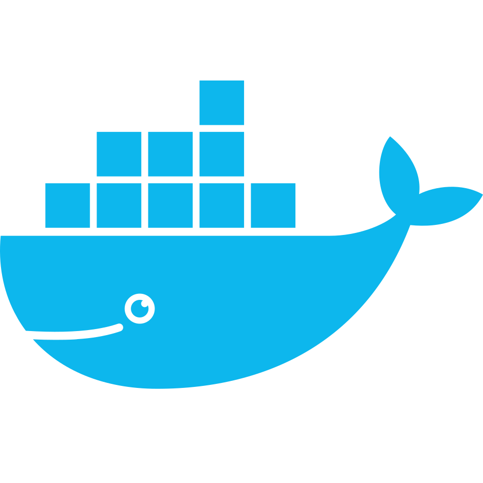
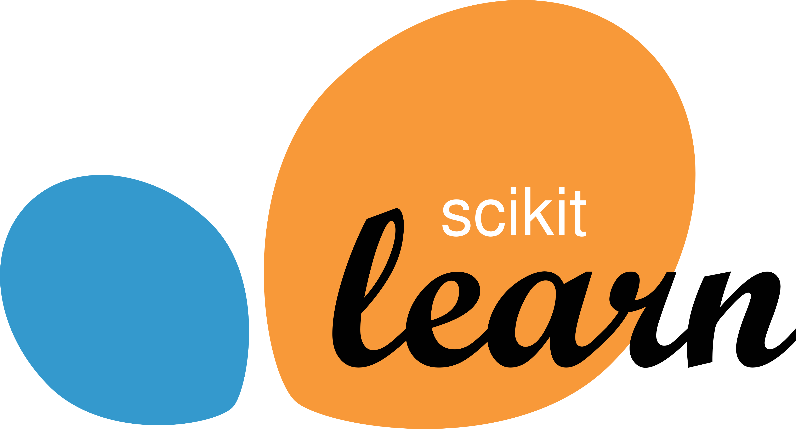

<!-- Social Section -->

  <i>Vamos codar?</i>

  
  

---
  
<h3 align="center">< SobreMim /></h3>

<!-- SOBRE:START -->
- 👨🏻‍💻 Ramilson Felix da Silva
- 🎓 Técnico em Informática (2017-2018)
- 🎓 Tecnólogo em Sistemas para Internet (2020-2023)
<!-- SOBRE:END -->

---

<!-- CONHECIMENTOS:START -->

<h3 align="center">< Experiência /></h3>

    
    
    
    
    
    
    
    
    
    
    
    
    

<!-- CONHECIMENTOS:END -->

---
